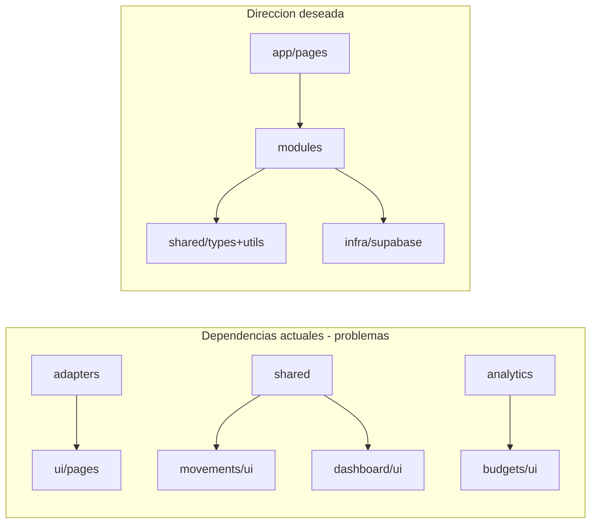

# Auditoría de código — savv

**Fecha:** septiembre 2026  
**Alcance:** revisión estática del código fuente (~183 archivos TS/TSX, ~9.200 LOC en módulos)  
**Objetivo:** evaluar cumplimiento de principios SOLID, detectar sobreingeniería y proponer mejoras ordenadas por esfuerzo.

---

## Resumen ejecutivo

`savv` es una app web de finanzas personales construida con Next.js (App Router), TypeScript, Supabase, TailwindCSS y next-intl. La arquitectura sigue un patrón modular por dominio documentado en [`AGENTS.md`](AGENTS.md): cada módulo en `src/modules/<dominio>/` organiza `actions/`, `services/`, `adapters/`, `types/`, `ui/` y `pages/`.

**Conclusión general:** la arquitectura es **pragmática y adecuada al tamaño actual del proyecto**. No hay sobreingeniería clásica (sin DI containers, repositorios abstractos, factories ni capas de abstracción innecesarias). El stack es coherente y legible.

Los problemas reales no son un exceso de capas, sino:

1. **Inconsistencia de capas** — adapters acoplados a UI, módulos con stacks incompletos (auth, settings, dashboard).
2. **Concentración de complejidad en `movements`** — god service, tipos inflados, lógica de extensión por `if/else`.
3. **Duplicación de UI y lógica** — selectores, delete buttons, charts, labels de categoría.
4. **Deuda técnica menor** — código muerto, naming inconsistente, errores i18n.

| Dimensión | Veredicto |
|-----------|-----------|
| SOLID global | Parcial — funcional para la escala actual |
| Sobreingeniería | Baja — algunos adapters triviales y charts Tremor sin uso |
| Subingeniería | Media — duplicación, tests limitados, schemas monolíticos |
| Mantenibilidad | Buena en CRUD simple; frágil en movements |

---

## Métricas y arquitectura

### Estructura del proyecto

```
src/
├── app/              # Rutas delgadas → delegan a *Page del módulo
├── modules/          # 10 dominios de negocio
├── infra/            # Supabase (client/server/admin), SQL, i18n
├── ui/               # Primitivos shadcn (22 componentes)
├── messages/         # i18n JSON (en/es)
└── proxy.ts          # Auth gate
```

### Módulos y completitud de capas

| Módulo | actions | services | adapters | types | pages | ui |
|--------|:-------:|:--------:|:--------:|:-----:|:-----:|:--:|
| accounts | ✓ | ✓ | ✓ | ✓ | ✓ | ✓ |
| categories | ✓ | ✓ | ✓ | ✓ | ✓ | ✓ |
| movements | ✓ | ✓ | ✓ | ✓ | ✓ | ✓ |
| budgets | ✓ | ✓ | ✓ | ✓ | ✓ | ✓ |
| dashboard | — | parcial | — | — | ✓ | ✓ |
| analytics | — | ✓ | ✓ | — | ✓ | ✓ |
| settings | — | ✓* | — | — | ✓ | ✓ |
| auth | ✓ | — | — | — | ✓ | — |
| landing | — | — | — | — | ✓ | ✓ |
| shared | toast | — | ✓ | ✓ | — | ✓ |

\* `settings/services.ts` usa `"use server"` — mezcla action y service.

### Flujo habitual (CRUD)

```
UI (client) → actions (server, zod) → services (Supabase) → DB/RPC
                    ↓
              adapters: Api/DB → View
              types: Api vs View
```

### Tests

Solo **8 archivos** de test, concentrados en movements y shared:

- `tests/modules/movements/services/movements.test.ts`
- `tests/modules/movements/services/movement-series.utils.test.ts`
- `tests/modules/movements/services/transfer.utils.test.ts`
- `tests/modules/movements/adapters/movements.adapter.test.ts`
- `tests/modules/shared/utils/schemas.test.ts`
- `tests/modules/shared/utils/common.test.ts`
- `tests/modules/budgets/utils/getAvailableBudgetCategories.test.ts`
- `tests/app/api/cron/cron-auth.test.ts`

Sin cobertura en accounts, categories, analytics ni dashboard.

---

## Evaluación SOLID

### S — Single Responsibility (Responsabilidad única)

**Veredicto: Parcial**

| Área | Estado | Evidencia |
|------|--------|-----------|
| accounts, budgets | ✓ Bien | Services acotados al dominio (~75 LOC en accounts) |
| categories | ~ Medio | Lógica global vs custom en action, no en service |
| movements | ✗ Mal | God service con múltiples responsabilidades |
| auth | ~ Medio | Onboarding cross-módulo en action |

**Violaciones concretas:**

1. **`src/modules/movements/services/movements.ts`** (~328 LOC) mezcla:
   - Listado paginado (`getMovementsByFilters`)
   - Agregaciones de dashboard (`getMonthIncomes`, `getMonthExpenses`)
   - CRUD (`insertMovement`, `updateMovement`, `deleteMovement`)
   - Queries de analytics (`getExpenses`)
   - Orquestación de series recurrentes/cuotas
   - Mapeo inline de `fullCategory` (duplicado 4+ veces en lugar de delegar al adapter)

2. **`src/modules/categories/actions/categories.action.ts`** — la decisión global vs custom es lógica de dominio en la capa de action:

   ```ts
   if (isGlobal) {
     await upsertUserCategory({ ... });
   } else {
     await updateCategory(categoryId, parsed.data);
   }
   ```

3. **`src/modules/auth/actions/user-action.ts`** — signup orquesta auth + `createAccount()` + `createSettings()` + redirect. Flujo de negocio que debería vivir en un service de onboarding.

4. **`src/modules/movements/ui/CreateMovement/MovementForm.tsx`** (~417 LOC) — formulario con demasiadas responsabilidades (validación, selects, schedules, series).

---

### O — Open/Closed (Abierto/Cerrado)

**Veredicto: Débil (aceptable a esta escala)**

No hay abstracciones extensibles. Añadir un nuevo tipo o schedule de movimiento requiere modificar código existente:

```ts
// src/modules/movements/services/movements.ts
if (movement.type === "expense" && movement.schedule === "recurring") {
  await createRecurringSeries(movement);
  return;
}
if (movement.type === "expense" && movement.schedule === "installment") {
  await createInstallmentSeries(movement);
  return;
}
// insert directo...
```

`updateMovement` usa flags opcionales (`updateSeries`) en lugar de un punto de extensión.

**Punto positivo:** discriminated unions en `MovementView` (`TransferView | ExpenseView | IncomeView`) permiten extender tipos en la capa de vista sin romper type-safety.

Para el tamaño actual del proyecto, el acoplamiento directo a Supabase y los `if/else` son pragmáticos. Solo sería problemático si se prevén muchos tipos nuevos de movimiento.

---

### L — Liskov Substitution (Sustitución de Liskov)

**Veredicto: N/A / Bueno**

No hay jerarquías de clases ni herencia. El proyecto usa funciones puras y tipos discriminados. Las unions de `MovementView` están bien modeladas y no hay sustituciones inválidas.

---

### I — Interface Segregation (Segregación de interfaces)

**Veredicto: Parcial**

**Problemas:**

1. **Actions reciben tipos completos cuando solo necesitan un subconjunto:**

   ```ts
   // Solo usa movement.id (y valida account.id innecesariamente)
   export const deleteMovementForm = async (movement: MovementView) => { ... }

   // Solo necesita { id, seriesId, applied }
   export const updateMovementForm = async (previous: MovementView, data: ...) => { ... }
   ```

2. **`MovementApi` es un tipo "fat"** con joins opcionales (`fullAccount`, `fullToAccount`, `fullCategory`). Cada query devuelve un subconjunto distinto, pero el tipo sugiere que todo está disponible. Faltarían tipos segregados: `MovementListItem`, `MovementDetail`, `MovementDashboardSummary`.

3. **`CategorySchema` compartido** para create/update y global/custom — los consumidores no saben qué campos aplican en cada caso.

**Puntos positivos:** `MovementView` por variantes (`type: "expense" | "income" | "transfer"`) es buen diseño de segregación en la capa de vista.

---

### D — Dependency Inversion (Inversión de dependencias)

**Veredicto: Débil (esperado con Supabase directo)**

**Estado actual:**

- **100% de los services** instancian `createClient()` directamente — sin interfaces de repositorio ni inyección.
- **Auth bypasses services:** `user-action.ts` llama a `supabase.auth.signUp` directamente.
- **RPC duplicado:** `save_movement_with_balance` se invoca desde `movements.ts` y desde `movement-series.ts` por rutas distintas.
- **Dependencias cross-módulo concretas:** `budgets/services/budgets.ts` importa `getCategories` de categories.

**Violación clara de dirección de dependencias — adapters acoplados a UI:**

| Archivo | Importa desde UI/pages |
|---------|------------------------|
| `src/modules/categories/adapters/categories.adapter.ts` | `CategoryForm`, `CategoryClient` |
| `src/modules/movements/adapters/movements.adapter.ts` | `MovementsPageProps` |

**Acoplamiento shared → dominios:**

| Archivo | Importa |
|---------|---------|
| `src/modules/shared/ui/Navbar/NavLinks.tsx` | `MovementDialog`, `FloatingAddButton` |
| `src/modules/analytics/ui/CategoryAverages.tsx` | `getCategoryLabel` desde `budgets/ui` |



Para un side project con Supabase, la ausencia de abstracción de persistencia es razonable. Se vuelve problemática si se necesita testear services unitariamente sin mock de Supabase o migrar de backend.

---

## Sobreingeniería vs subingeniería

### Lo que NO es sobreingeniería (bien hecho)

| Patrón | Por qué funciona |
|--------|------------------|
| Actions → services → Supabase | Coherente, legible, sin capas extra |
| RPCs transaccionales en PostgreSQL | Lógica crítica de balances en DB (`002_save_movement_with_balance.sql`) |
| `FormDialog` responsive | Abstracción que aporta valor real (Dialog/Sheet según viewport) |
| `movement-series.ts` + `transfer.utils.ts` | Sub-módulos de dominio bien extraídos |
| Discriminated unions en `MovementView` | Tipado fuerte sin clases |
| Rutas delgadas en `src/app/` | Separación clara app vs dominio |
| i18n por namespace de dominio | `src/messages/{en,es}/*.json` |

### Sobreingeniería leve

| Señal | Archivo(s) | Evaluación |
|-------|-----------|------------|
| Adapter trivial (9 líneas) | `src/modules/accounts/adapters/account.adapter..ts` | Renombrado de 3 campos; capa extra con poco valor |
| Toast en 3 capas | `toast-store.ts`, `Toast/toast-manager.tsx`, `actions/toast.ts` | Zustand store sin estado real; delega a Sonner |
| Chart Tremor sin uso | `src/ui/bar-chart.tsx` (~886 LOC) | **0 imports** en el proyecto |
| Chart Tremor infrautilizado | `src/ui/area-chart.tsx` (~995 LOC) | Usado solo en `BalanceTimelineChart.tsx` |
| Helpers Tremor | `chartUtils.ts`, `useOnWindowResize.ts` | Solo para charts anteriores |
| `DataProvider` | `src/modules/shared/stores/DataProvider.tsx` | Capa fina sobre datos ya adaptados en layout |
| Re-export vacío | `MovementsFilter.tsx` → alias de `MovementsFilters` | Sin valor |
| `parseMovementsSearchParams` async | `movements.adapter.ts` | Parsing de URL en adapter; el `async` no tiene awaits |

### Subingeniería / deuda técnica

| Señal | Archivo(s) | Impacto |
|-------|-----------|---------|
| Schemas monolíticos (5 dominios) | `src/modules/shared/utils/schemas.ts` | Mezcla responsabilidades cross-dominio |
| Duplicación de selectores URL | `SelectAccount.tsx` vs lógica inline en `MovementsFilters.tsx` | Mantenimiento doble |
| Duplicación delete buttons | 4 archivos `Delete*Button.tsx` | Mismo patrón ×4 |
| Duplicación charts gastos | `ExpenseByCatChart.tsx`, `ExpensesDataChart.tsx` | Fetch + skeleton + grid casi idénticos |
| Label categoría global repetido | 10+ componentes | Patrón `isGlobal && !isCustomName ? t(...) : title` |
| Adaptadores de categorías duplicados | `categories.adapter.ts` + `shared/adapters/adaptCategories.ts` | Magic number `"60"` hardcodeado en shared |
| Código muerto | `ConfirmDelete.tsx`, `SelectCategory.tsx`, exports en `cn.ts`/`constants.ts` | Ruido en el codebase |
| Naming inconsistente | `account.adapter..ts`, `categories.action.ts` vs `account-actions.ts` | Confusión al navegar |
| Errores server sin i18n | `movement-action.ts` | Strings en inglés mostrados al usuario |
| Errores inconsistentes | `"databaseError" + error` en categories/budgets | Concatena objeto Error |
| Tests limitados | 8 archivos, solo movements/shared | Sin red de seguridad en CRUD |
| Clases Tailwind dinámicas | `CategoryIcon.tsx`, `ColorPicker.tsx`, charts | `bg-${color}-500` — JIT no las genera sin safelist |

---

## Hallazgos por área

### Movements (mayor deuda)

| Hallazgo | Severidad | Archivo |
|----------|-----------|---------|
| God service con 5+ responsabilidades | Alta | `services/movements.ts` |
| Mapeo `fullCategory` duplicado en service | Media | `services/movements.ts` L16-27, L89-95 |
| RPC `save_movement_with_balance` duplicado | Media | `movements.ts` + `movement-series.ts` |
| Actions con tipos inflados | Media | `actions/movement-action.ts` |
| Errores sin traducir | Media | `actions/movement-action.ts` L25, L34, L63, L78 |
| `deleteMovementForm` sin `ServerActionResponse` | Baja | `actions/movement-action.ts` L42-52 |
| Formulario monolítico (~417 LOC) | Media | `ui/CreateMovement/MovementForm.tsx` |
| Adapter acoplado a page props | Media | `adapters/movements.adapter.ts` |

### Shared

| Hallazgo | Severidad | Archivo |
|----------|-----------|---------|
| Navbar importa UI de movements/dashboard | Alta | `ui/Navbar/NavLinks.tsx` |
| Schemas de 5 dominios en un archivo | Media | `utils/schemas.ts` |
| `parseMovementsForChart` con nombre genérico | Baja | `utils/common.ts` |
| Toast triple capa sin estado | Baja | `ui/toast-store.ts`, `Toast/`, `actions/toast.ts` |
| `ConfirmDelete.tsx` sin usos | Baja | `ui/common/ConfirmDelete.tsx` |
| `SelectCategory.tsx` sin usos | Baja | `ui/common/SelectCategory.tsx` |
| `adaptCategories` con magic number | Media | `adapters/adaptCategories.ts` |
| `AccountSelect` con `$` hardcodeado | Baja | `ui/common/AccountSelect.tsx` L45 |

### Categories / Budgets

| Hallazgo | Severidad | Archivo |
|----------|-----------|---------|
| Lógica global/custom en action | Media | `actions/categories.action.ts` |
| Adapter importa tipos de UI | Alta | `adapters/categories.adapter.ts` |
| `toggleCategoryVisibility` sin validación ni errores | Media | `actions/categories.action.ts` |
| `getCategoryLabel` exportado desde UI de budgets | Media | `budgets/ui/BudgetWidgetContent.tsx` |
| Adapter con lógica real (bien) | — | `adapters/budgets.adapter.ts`, `categories.adapter.ts` |

### Dashboard / Analytics

| Hallazgo | Severidad | Archivo |
|----------|-----------|---------|
| Frontera difusa dashboard vs analytics | Baja | Ambos tienen charts y net worth |
| Charts de gastos duplicados | Media | `ExpenseByCatChart.tsx`, `ExpensesDataChart.tsx` |
| `formatCurrency` duplicado localmente | Baja | `analytics/ui/CategoryAverages.tsx` |
| `HomePage` con `accountId = "all"` fijo | Baja | `dashboard/pages/HomePage.tsx` |

### Auth / Settings

| Hallazgo | Severidad | Archivo |
|----------|-----------|---------|
| Onboarding cross-módulo en action | Media | `auth/actions/user-action.ts` |
| Sin capa services en auth | Baja | — |
| `settings/services.ts` con `"use server"` | Baja | `settings/services/settings.ts` |

### Infra / i18n

| Hallazgo | Severidad | Archivo |
|----------|-----------|---------|
| Lista manual de namespaces duplicada | Baja | `infra/i18n/request.ts` |
| Namespaces inconsistentes en componentes | Media | Varios (root vs dominio) |
| Keys Zod duplicadas entre namespaces | Baja | `amountPositiveError` en movements y budgets |

---

## Recomendaciones (de más sencilla a más compleja)

### S — Rápidas (< 1 hora cada una)

| # | Acción | Archivos | Impacto |
|---|--------|----------|---------|
| S1 | Eliminar `bar-chart.tsx` (código muerto, ~886 LOC) | `src/ui/bar-chart.tsx` | Alto — reduce ruido |
| S2 | Eliminar `ConfirmDelete.tsx` (0 imports) | `src/modules/shared/ui/common/ConfirmDelete.tsx` | Bajo |
| S3 | Eliminar `SelectCategory.tsx` (0 imports) | `src/modules/shared/ui/common/SelectCategory.tsx` | Bajo |
| S4 | Eliminar exports sin uso en `cn.ts` y `constants.ts` | `src/modules/shared/utils/cn.ts`, `constants.ts` | Bajo |
| S5 | Renombrar `account.adapter..ts` → `account.adapter.ts` | `src/modules/accounts/adapters/` | Bajo — claridad |
| S6 | Unificar `formatCurrency` en `CategoryAverages.tsx` | `src/modules/analytics/ui/CategoryAverages.tsx` | Medio |
| S7 | Usar `formatCurrency` en `AccountSelect.tsx` (eliminar `$` hardcodeado) | `src/modules/shared/ui/common/AccountSelect.tsx` | Medio |
| S8 | Traducir errores hardcodeados en `movement-action.ts` | `src/modules/movements/actions/movement-action.ts` | Alto — UX |
| S9 | Estandarizar namespaces i18n (evitar `useTranslations()` sin namespace) | `CategorySelect.tsx`, `BudgetWidgetContent.tsx`, etc. | Medio |
| S10 | Corregir errores `"databaseError" + error` → mensaje legible | `categories.action.ts`, `budget-actions.ts` | Medio |
| S11 | Eliminar re-export vacío `MovementsFilter.tsx` | `src/modules/movements/ui/MovementsFilter/` | Bajo |
| S12 | Traducir `"Uncategorized"` en `common.ts` | `src/modules/shared/utils/common.ts` L47 | Bajo |

---

### M — Medias (1–4 horas cada una)

| # | Acción | Archivos | Impacto |
|---|--------|----------|---------|
| M1 | Extraer `getCategoryLabel` a `categories/utils/` o `shared/utils/` | `BudgetWidgetContent.tsx`, `CategoryAverages.tsx`, +10 consumidores | Alto |
| M2 | Consolidar `ExpenseByCatChart` + `ExpensesDataChart` en componente compartido | `dashboard/ui/ExpenseByCat/`, `dashboard/ui/expenses/` | Alto |
| M3 | Unificar selectores URL: reutilizar `SelectAccount` en `MovementsFilters` | `MovementsFilters.tsx`, `SelectAccount.tsx` | Medio |
| M4 | Factorizar `Delete*Button` en componente genérico `ConfirmDeleteButton` | 4 archivos en accounts/budgets/categories/movements | Medio |
| M5 | Mover tipos `CategoryClient` de UI a `categories/types/` | `categories.adapter.ts`, `CategoryForm.tsx` | Alto — DIP |
| M6 | Centralizar mapeo `fullCategory` en adapter; eliminar duplicación en service | `movements.ts`, `movements.adapter.ts` | Alto |
| M7 | Unificar llamada RPC `saveMovementRpc` (una sola función) | `movements.ts`, `movement-series.ts` | Medio |
| M8 | Hacer `deleteMovementForm` consistente (`ServerActionResponse`, try/catch) | `movement-action.ts` | Bajo |
| M9 | Extraer helper `getDateFnsLocale(locale)` para evitar repetición | `MovementForm.tsx`, `MovementsFilters.tsx` | Bajo |
| M10 | Safelist o mapa estático para clases Tailwind dinámicas | `CategoryIcon.tsx`, `ColorPicker.tsx`, charts | Medio — visual |
| M11 | Consolidar `adaptCategories` (shared) con `categories.adapter.ts` | `shared/adapters/adaptCategories.ts` | Medio |
| M12 | Simplificar toast: eliminar Zustand store, usar Sonner directo en client | `toast-store.ts`, consumidores | Bajo |

---

### L — Grandes (medio día o más)

| # | Acción | Archivos | Impacto |
|---|--------|----------|---------|
| L1 | Dividir `movements.ts` en sub-services: `movements-queries.ts`, `movements-mutations.ts`, `movements-aggregations.ts` | `src/modules/movements/services/` | Alto — SRP |
| L2 | Mover schemas Zod a cada dominio (`movements/schemas.ts`, `accounts/schemas.ts`, etc.) | `shared/utils/schemas.ts` → módulos | Alto — SRP |
| L3 | Crear `categories/services/category-update.ts` con lógica global/custom | `categories.action.ts` → service | Medio — SRP |
| L4 | Crear `auth/services/onboarding.ts` para flujo signup | `user-action.ts` → service | Medio — SRP |
| L5 | Reducir props de actions a tipos mínimos (`{ id }`, `{ id, seriesId, applied }`) | `movement-action.ts`, `types/` | Medio — ISP |
| L6 | Crear tipos segregados: `MovementListItem`, `MovementDetail` | `movements/types/types.ts` | Medio — ISP |
| L7 | Desacoplar `NavLinks` de movements/dashboard (composición desde layout) | `NavLinks.tsx`, `app/(app)/layout.tsx` | Alto — DIP |
| L8 | Evaluar eliminación de charts Tremor custom; usar librería más simple o Recharts | `src/ui/area-chart.tsx`, `bar-chart.tsx` | Medio — bundle size |
| L9 | Añadir tests para accounts, categories, budgets (al menos services) | `tests/modules/` | Alto — confianza |
| L10 | Estandarizar naming de archivos (`*-actions.ts` en todos los módulos) | Varios actions | Bajo — DX |

---

### XL — Estructurales (solo si el proyecto crece significativamente)

| # | Acción | Cuándo aplicar | Impacto |
|---|--------|----------------|---------|
| XL1 | Introducir interfaces de repositorio + inyección para testabilidad | Si se necesitan tests unitarios sin Supabase | Alto |
| XL2 | Strategy map / registry para tipos y schedules de movimiento | Si se añaden 3+ tipos nuevos de movimiento | Alto — O/C |
| XL3 | Fusionar o delimitar claramente dashboard vs analytics | Si la frontera sigue difuminándose | Medio |
| XL4 | Evaluar si `DataProvider` aporta vs props desde layout | Si el context no crece | Bajo |
| XL5 | Capa de application services para orquestación cross-módulo | Si auth/settings/dashboard ganan flujos complejos | Alto |
| XL6 | Migrar lógica de agregación a vistas/materialized views en PostgreSQL | Si queries de dashboard se vuelven lentas | Alto — performance |

---

## Matriz de priorización

Impacto vs esfuerzo para decidir qué abordar primero:

|  | Esfuerzo S | Esfuerzo M | Esfuerzo L | Esfuerzo XL |
|--|:----------:|:----------:|:----------:|:-----------:|
| **Impacto alto** | S1, S8 | M1, M2, M5, M6 | L1, L2, L7, L9 | XL1, XL2 |
| **Impacto medio** | S6, S7, S9, S10 | M3, M4, M7, M10, M11 | L3, L4, L5, L6, L8 | XL3, XL5, XL6 |
| **Impacto bajo** | S2–S5, S11, S12 | M8, M9, M12 | L10 | XL4 |

### Orden sugerido (quick wins primero)

1. **S1** — Eliminar `bar-chart.tsx` (impacto inmediato, cero riesgo)
2. **S8** — Traducir errores de movements (mejora UX visible)
3. **S2–S4** — Limpiar código muerto restante
4. **M6** — Centralizar mapeo en adapter (reduce bugs en movements)
5. **M1** — Extraer `getCategoryLabel` (elimina dependencia analytics → budgets)
6. **M2** — Consolidar charts de gastos
7. **L1** — Dividir god service de movements
8. **L2** — Distribuir schemas por dominio

---

## Conclusión

`savv` tiene una base arquitectónica sólida y pragmática. La modularización por dominio funciona bien para entidades CRUD (accounts, categories, budgets) y el uso de RPCs transaccionales en PostgreSQL es una decisión acertada.

Los principios SOLID se cumplen de forma **parcial y consciente**: la inversión de dependencias es débil por diseño (Supabase directo), lo cual es aceptable a esta escala. Los problemas más urgentes son de **consistencia** (capas, naming, i18n) y **concentración** (movements como god module), no de sobreingeniería.

La mayoría de mejoras recomendadas son incrementales y de bajo riesgo. Las acciones estructurales (XL) solo tienen sentido si el proyecto crece en complejidad o equipo.

---

*Documento generado como auditoría estática. No incluye análisis de rendimiento en runtime ni revisión de seguridad (RLS, auth flows).*
